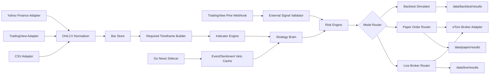
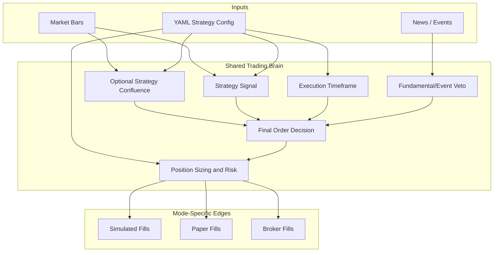
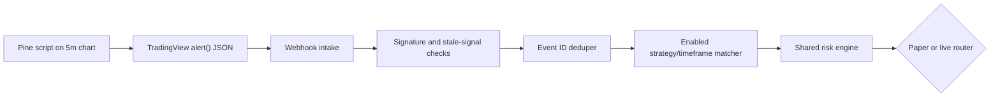

# Architecture

## System View



## Web UI

`TradingFlow.Web` is an ASP.NET Core Razor Pages application for operating the local research workflow:

```text
Dashboard
  -> Backtest jobs
  -> Paper readiness

Backtest Lab
  -> read shared configs and strategy YAML
  -> select tickers and strategies
  -> generate config under configs/backtest/ui-runs
  -> run BacktestRunner in background
  -> preview winner, trades, diagnostics, and analyzer suggestions

Paper Lab
  -> read paper config
  -> inspect signal source, tickers, strategies, and execution mode
  -> validate eToro/Alpaca keys with read-only checks
  -> live edit Strategy YAML and config via AJAX without page reloads
  -> launch and monitor live background paper trading jobs

Live Job Monitor
  -> view live market data
  -> view Decision Audit logs showing exactly why trades were accepted or rejected
```

The UI does not bypass config. It writes a generated run config and then calls the same backtest engine used by the CLI.

## Decision Auditing

Every strategy evaluation, whether it results in a placed order or a rejection (e.g., RSI outside range, trend filter failed), is logged to a `DecisionAudits` SQLite table via Entity Framework Core. This provides deep transparency into the `RiskEngine` and `StrategyBrain` behavior during live and paper execution.

## One Brain Model



## Core Interfaces

```text
IMarketDataProvider
  -> YahooFinanceProvider
  -> TradingViewProvider
  -> CsvMarketDataProvider

IBarStore
  -> LocalFileBarStore

IStrategyCatalog
  -> YamlStrategyCatalog

ITradingBrain
  -> ConfluenceTradingBrain

IOrderRouter
  -> BacktestOrderRouter
  -> PaperOrderRouter
  -> LiveBrokerOrderRouter
```

## Timeframe Model

Each strategy config owns three distinct timeframe roles:

```text
timeframe             -> signal/setup timeframe, such as 5m, 15m, or 1h
execution.timeframe   -> entry, stop, target, trailing, and exit fill timeframe
confluence.timeframe  -> optional higher-timeframe trend filter
```

This prevents the run config from forcing `1h` bars onto every strategy. Intraday strategies can run purely on `5m`. Swing and trend strategies can read `1h` for setup while still entering and exiting on `5m` bars.

The engine derives only the timeframes required by the selected strategies and their enabled confluence rules. The run config only declares provider downloads and `derive_from`.

## Portfolio Allocation

Each strategy is tested independently from the configured starting capital. Within one strategy test, all tickers can compete for simultaneous positions. Allocation is controlled by:

```text
portfolio.max_concurrent_positions
portfolio.max_position_value_pct
portfolio.risk_per_trade_pct
```

With `max_concurrent_positions: 5` and `max_position_value_pct: 20.0`, each accepted trade gets at most one fifth of the current equity, while final share quantity is still constrained by stop-distance risk sizing.

## Data Isolation

Backtest, paper, and live modes write to separate roots:

```text
data/backtest/raw, data/backtest/normalized, data/backtest/results
data/paper/raw,    data/paper/normalized,    data/paper/results
data/live/raw,     data/live/normalized,     data/live/results
```

Backtest data can be refreshed, replayed, and deleted freely. Paper and live data are operational records and should not be mixed with historical simulation artifacts.

## Distributed Pod Architecture

The system supports multiple concurrent pods (e.g., UI instances or worker nodes) to ensure horizontal scalability and high availability:
- **Shared State**: A central SQLite database (`tradingflow.db`) is used to synchronize state across pods using Entity Framework Core.
- **Ticker Locking**: The `SqliteTickerLockService` prevents two pods from processing the same ticker concurrently. It uses a 3-minute TTL to ensure locks from dead/crashed pods are eventually released.
- **Order State Recovery**: Open orders are persisted via `SqliteOrderStateRepository`. If a pod crashes while managing a trade, another pod will retrieve the active orders and resume monitoring the exit conditions based on the persisted `StrategyName` and `EntryPrice`.

## TradingView Signal Path

Backtests use internal candle signals so historical replay stays deterministic. Paper and live modes may instead use TradingView Pine alerts for signal timing:



The Pine scripts live under `tradingview/pine`. Swing scripts run on a `5m` chart and use `request.security(..., lookahead_off)` for `15m` or `1h` setup/confluence values. This keeps the operational alert path aligned with the engine's model: higher timeframe for setup, lower timeframe for execution.

The validator rejects disabled signal sources, unsigned signals when required, duplicate event IDs, stale or future bars, strategies not enabled in that mode, strategy/version/timeframe mismatches, and invalid long-entry bracket prices.

## eToro Adapter

`TradingFlow.Etoro` is a separate adapter project. It keeps broker concerns outside the shared trading brain:

```text
EtoroApiClient
  -> auth headers: x-request-id, x-api-key, x-user-key
  -> read/write rate buckets
  -> 429 Retry-After and exponential backoff

EtoroInstrumentResolver
  -> ticker to instrumentId cache

EtoroMarketDataProvider
  -> rates
  -> historical candles

EtoroOrderRouter
  -> demo open:  POST /api/v2/trading/execution/demo/orders
  -> live open:  POST /api/v2/trading/execution/orders
  -> demo close: POST /api/v1/trading/execution/demo/market-close-orders/positions/{positionId}
  -> live close: POST /api/v1/trading/execution/market-close-orders/positions/{positionId}

EtoroPortfolioClient
  -> portfolio
  -> PnL
  -> order status

EtoroInsightsClient
  -> instrument feed posts
  -> watchlists and curated lists
  -> market recommendations
  -> notification messages

EtoroWebSocketClient
  -> instrument:<instrumentId>
  -> private
```

Write endpoints do not blindly retry by default. If a write request times out or returns a retryable status after reaching eToro, the safe operational path is to inspect order status, portfolio, or the private WebSocket stream before submitting another order.

## Current Milestone

The first build target is:

```text
YAML strategy + Yahoo/Csv bars -> normalized OHLCV -> required timeframe derivation -> indicators -> strategy decision -> simulated orders -> portfolio result JSON with Winner summary
```

The Go sidecar starts as an HTTP service contract:

```text
GET /health
GET /v1/veto/{ticker}
POST /v1/news
```

## TPL Pipeline Rule

The engine should use task-based concurrency boundaries throughout:

```text
Load config
  -> create per-ticker tasks
  -> download/load bars
  -> normalize/cache bars
  -> derive only selected strategy/confluence timeframes
  -> compute indicators after warm-up
  -> evaluate strategies
  -> simulate orders with portfolio slot allocation
  -> aggregate portfolio result
```

`worker_count` in YAML controls ticker parallelism. `0` means auto CPU-based parallelism.

Manual thread creation should not be used in application code. Use `Task`, `Parallel.ForEachAsync`, channels, or TPL Dataflow blocks when package restore is available and a true block pipeline is needed.
