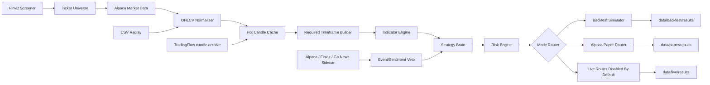
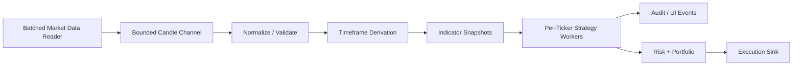

# Architecture

## Current System View



## One Brain Model

Backtest, paper, and live modes should all use the same strategy evaluation path:

```text
OHLCV candles
  -> required timeframe derivation
  -> indicator snapshots
  -> confluence gate
  -> strategy signal
  -> entry validation
  -> portfolio/risk sizing
  -> simulated, paper, or live execution sink
```

The source and sink change by mode. The brain does not.

## Strategy Catalog Separation

Strategies are separated by evidence level:

```text
configs/strategies/
  promoted/runtime strategies that may appear in paper/backtest UI

configs/backtest/strategies/
  research-only strategies used for experiments and audits
```

Do not mutate a promoted strategy for experiments. Copy it into the research/backtest strategy area, change the copy, run it, capture the result in `docs/strategy-last-runs.md`, and promote only after verification.

The July 2026 intraday execution spec is implemented as research-only. The shared engine now supports generic execution primitives for those configs:

- opening-range breakout/breakdown buffers
- prior inside-day / NR7 compression gates
- VWAP-minus-ATR and opening-range-opposite stop modes
- extreme-shadow stop mode for divergence fades
- VWAP profit target mode
- failed-breakout circuit breaker

Partial exits are not supported yet because `BacktestTrade` currently represents one entry and one full-position exit. Supporting partial exits requires trade execution legs and per-leg realized P/L.

## Web UI

`TradingFlow.Web` is an ASP.NET Core Razor Pages app for local research and paper operations. Its
primary navigation follows the operator's workflow:

```text
Desk        -> wishlist monitoring, current evidence, news, and explicit symbol selection
Positions   -> broker positions, protection state, P/L, and reviewed close workflow
Research    -> backtests, optimization jobs, result details, and decision audits
Operations  -> paper runs, paper-job details, warm-up, and wishlist administration
```

Trade Desk rows are read-only. A protected paper buy starts only after explicit symbol selection and
a server-owned review on the dedicated order ticket. The review token is short-lived and the server
revalidates broker and market evidence before confirmation. UI code calls application APIs; strategy,
risk, admission, execution, and orchestration remain outside Razor page logic.

The Android shell uses `Watch`, `Positions`, `Activity`, and `More`. Symbol details and the reviewed
paper-order ticket are secondary routes, so monitoring stays compact while execution remains
deliberate. See `docs/ui-operator-runbook.md` for the implemented navigation and safety boundaries.

## Timeframe Model

Each strategy owns three timeframe roles:

```text
timeframe             -> signal/setup timeframe
execution.timeframe   -> entry, stop, target, trailing, and exit fill timeframe
confluence.timeframe  -> optional higher-timeframe trend filter
```

The run config declares provider downloads and a derivation source. The engine derives only the strategy-required missing timeframes.

## Portfolio Allocation

Each strategy is tested independently from the configured starting capital. Within one strategy test, all tickers compete for simultaneous positions. Allocation is controlled by:

```text
portfolio.max_concurrent_positions
portfolio.max_position_value_pct
portfolio.risk_per_trade_pct
```

With `max_concurrent_positions: 5` and `max_position_value_pct: 20.0`, each accepted trade gets at most one fifth of current equity before stop-distance risk sizing is applied.

## Data Isolation

Backtest, paper, and live modes write to separate roots:

```text
data/backtest/raw, data/backtest/normalized, data/backtest/results
data/paper/raw,    data/paper/normalized,    data/paper/results
data/live/raw,     data/live/normalized,     data/live/results
```

Backtest data can be refreshed and deleted freely. Paper/live data is operational state and must be preserved unless explicitly cleaned.

Runtime artifacts and research artifacts are intentionally separate, but current research/paper operation defaults to full audit retention. Full retention keeps trade-level detail, rejection context, diagnostics, and accepted order detail so failed strategies can be explained without rerunning. Heavy optimization jobs may explicitly opt down to `artifacts.retention_mode: summary` only when trade-level replay is not needed.

## Azure Storage Model

AKS uses three storage tiers:

```text
/app/data     -> single-writer Azure Disk for SQLite and operational state
/app/backups  -> separate durable backup mount with Azure Blob archival
/app/cache    -> pod-local emptyDir for high-churn candle/indicator working files
```

SQLite runs in WAL mode with `synchronous=FULL` and must not live on Azure Files or another network filesystem. The pod that owns `/app/data` is the sole SQLite writer. Daily online backups are integrity-checked, SHA-256 manifested, and retained under `/app/backups`; see `docs/database-backup-restore.md`.

TradingFlow owns its own candle cache and archive. The ML/research project can fetch the same Alpaca candles independently and choose Parquet or feature-store formats without forcing TradingFlow to carry that storage dependency.

## Distributed State

SQLite is used locally for:

- job persistence
- decision audit records
- ticker locks
- active paper order state
- the versioned production journal, including write-ahead order intents

The production order journal is the source of truth for order lifecycle. An order
intent and its initial `INTENT` event commit atomically. The shared submission
service then appends `SUBMITTED` before broker I/O and `ACKED` only from a broker
receipt. LiveRunner and mobile automation project typed broker updates through the
same `OrderLifecycleService`; cumulative partial fills and cancel requests are
append-only events. Mutable paper-order rows remain UI projections and must not be
used to infer terminal broker state. In particular, absence from an open-order
snapshot is not evidence of fill, cancellation, rejection, or expiry.

Every broker position is also subject to the EXE-09 protective-order invariant.
Startup and periodic account reconciliation, plus an immediate REST cross-check after
each partial or complete fill, flatten Alpaca's nested order graph and verify that the
entire position quantity is covered by an opposite-side broker-resting stop. Missing
coverage is repaired through the same write-ahead submission API used by entries, but
as a risk-reducing `BACKSTOP` GTC stop that bypasses entry admission blocks. The stop
uses persisted strategy structure when available, otherwise a point-in-time daily ATR
fallback computed only from earlier bars. Broker repair never silently clears the
incident: missing or excess protection is journaled as a reconciliation mismatch and
requires operator acknowledgement. A temporary backstop is cancelled only after the
strategy/bracket stop is active and covers the full position; foreign or manual stops
are never cancelled by this cleanup path.

Position ownership is strategy-tagged in the append-only ledger. Each fill records
the strategy that executed the order and the strategy that owns the resulting net
position. Reductions and protective exits preserve the opening owner; ownership can
change only after the symbol reaches a flat quantity. Before any entry, EXE-10 obtains
a durable namespaced ticker lease and checks both the latest position and every
nonterminal entry intent. This serializes concurrent strategy submissions even before
the broker reports a fill. A cross-strategy conflict or unavailable lease fails before
intent reservation and broker I/O. Exits and protective stops do not pass through this
entry-only guard, so risk reduction cannot be delayed by ownership contention.

`appsettings.local.json` and `launchSettings.json` are developer-machine files and are
ignored by Git. The local settings file is loaded only in Development. Production
credentials must be supplied by the deployment configuration and secret provider.

Ticker locks prevent multiple workers from processing the same ticker concurrently. Order state lets paper jobs recover after a web/worker restart.

## Candle Event Pipeline

Market data preparation now runs through `CandlePipelineEngine`, a bounded channel pipeline shared by backtest and paper/live runners:



Important rules:

- Backtest replay, paper polling/websocket, and future live streaming all publish candle events.
- Processing is parallel across ticker/timeframe keys.
- Processing remains ordered within one ticker/timeframe key.
- Buffers are bounded so slow broker/audit sinks apply backpressure.
- Alpaca batched reads fetch many symbols per timeframe, then fan out into candle events.
- `TradingFlow.Web` does not compute indicators or strategy decisions; it resolves config/credentials and calls module APIs.

