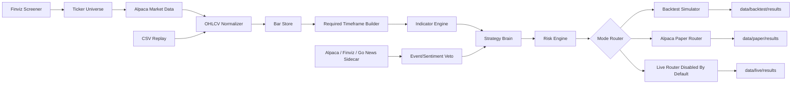
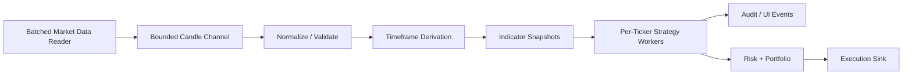

# Architecture

## Current System View



## One Brain Model

Backtest, paper, and live modes should all use the same strategy evaluation path:

```text
OHLCV candles
  -> required timeframe derivation
  -> indicator snapshots
  -> confluence gate
  -> strategy signal
  -> entry validation
  -> portfolio/risk sizing
  -> simulated, paper, or live execution sink
```

The source and sink change by mode. The brain does not.

## Web UI

`TradingFlow.Web` is an ASP.NET Core Razor Pages app for local research and paper operations:

```text
Dashboard
  -> recent jobs
  -> quick navigation

Backtest Lab
  -> read shared configs and strategy YAML
  -> select tickers and strategies
  -> edit strategy parameters
  -> generate config under configs/backtest/ui-runs
  -> run BacktestRunner in background
  -> preview winner, trades, diagnostics, and analyzer suggestions

Paper Lab
  -> read paper config
  -> validate Alpaca credentials with read-only checks
  -> launch and monitor paper jobs
  -> show live market metrics, broker orders/positions, profiler data, and decision audits
```

The UI writes config and calls the same engine used by CLI/worker flows.

## Timeframe Model

Each strategy owns three timeframe roles:

```text
timeframe             -> signal/setup timeframe
execution.timeframe   -> entry, stop, target, trailing, and exit fill timeframe
confluence.timeframe  -> optional higher-timeframe trend filter
```

The run config declares provider downloads and a derivation source. The engine derives only the strategy-required missing timeframes.

## Portfolio Allocation

Each strategy is tested independently from the configured starting capital. Within one strategy test, all tickers compete for simultaneous positions. Allocation is controlled by:

```text
portfolio.max_concurrent_positions
portfolio.max_position_value_pct
portfolio.risk_per_trade_pct
```

With `max_concurrent_positions: 5` and `max_position_value_pct: 20.0`, each accepted trade gets at most one fifth of current equity before stop-distance risk sizing is applied.

## Data Isolation

Backtest, paper, and live modes write to separate roots:

```text
data/backtest/raw, data/backtest/normalized, data/backtest/results
data/paper/raw,    data/paper/normalized,    data/paper/results
data/live/raw,     data/live/normalized,     data/live/results
```

Backtest data can be refreshed and deleted freely. Paper/live data is operational state and must be preserved unless explicitly cleaned.

Runtime artifacts and research artifacts are intentionally separate. Backtest, paper, and worker jobs default to summary result JSON so UI polling and repeated optimization runs do not accumulate full trade detail. Research configs can opt into `artifacts.retention_mode: full` when the full trade/order archive is needed for deeper analysis.

## Distributed State

SQLite is used locally for:

- job persistence
- decision audit records
- ticker locks
- active paper order state

Ticker locks prevent multiple workers from processing the same ticker concurrently. Order state lets paper jobs recover after a web/worker restart.

## Candle Event Pipeline

Market data preparation now runs through `CandlePipelineEngine`, a bounded channel pipeline shared by backtest and paper/live runners:



Important rules:

- Backtest replay, paper polling/websocket, and future live streaming all publish candle events.
- Processing is parallel across ticker/timeframe keys.
- Processing remains ordered within one ticker/timeframe key.
- Buffers are bounded so slow broker/audit sinks apply backpressure.
- Alpaca batched reads fetch many symbols per timeframe, then fan out into candle events.
- `TradingFlow.Web` does not compute indicators or strategy decisions; it resolves config/credentials and calls module APIs.
