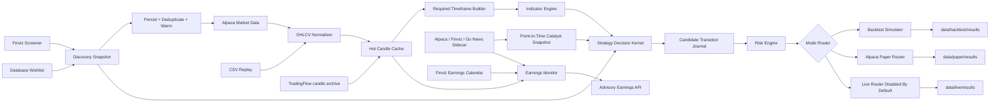
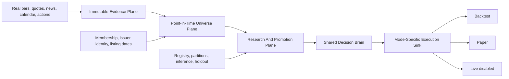
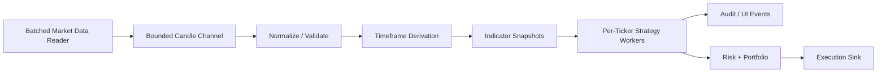

# Architecture

## Current System View



## One Brain Model

Backtest, paper, and live modes should all use the same strategy evaluation path:

```text
OHLCV candles
  -> required timeframe derivation
  -> indicator snapshots
  + persisted discovery/universe/regime evidence
  + point-in-time catalyst revisions
  -> immutable strategy admission profile
  -> shared decision kernel
  -> Discovered / DataWarming / Qualified / Armed / Triggered journal
  -> canonical pre-risk order plan
  -> twelve entry gates
  -> portfolio/risk sizing
  -> simulated, paper, or live execution sink
```

The source, candidate-journal implementation, and execution sink change by mode.
The strategy artifact, semantic decision kernel, transition graph, completed-bar
timing, and reasons do not. Backtests use an isolated in-memory candidate journal;
every discovery/decision is also flushed to a per-worker recovery journal before
evaluation continues. Paper/live use the SQLite operational journal. Completed
backtests atomically publish the candidate records and transition evidence in a
dedicated decision-audit sidecar and remove the recovery spools; interrupted workers
leave their uniquely named spools for diagnosis.
Candidate IDs include the owning run, so parallel runs cannot consume or revalidate
each other's setup.

The kernel's canonical order plan freezes strategy direction, trigger reference,
completed pre-fill stop, target policy/reference, slippage, and expiry. Account risk,
portfolio reservations, fills, and position protection remain downstream
responsibilities. The first Phase 5 checkpoint now atomically commits
`Triggered -> Consumed`, the immutable order intent, its initial `INTENT` event, and
the evidence hashes that bind them. A database invariant permits only one intent per
candidate. An exact candidate that expires before reservation is atomically moved to
`Expired` without creating an intent. Strategy authorization and authoritative
provider-session evidence are resolved in the ordered gate chain; the provider trade
date, rather than a caller timestamp, owns the session-scoped intent identity.

Protective-stop reconciliation derives one deterministic owner intent per persisted
position generation, symbol, side, and replacement revision. A nonterminal owner is
reused when it is absent from a potentially stale broker snapshot, preventing changed
prices from creating a sibling stop. Broker-visible active coverage may add a
deterministic supplemental revision for only the remaining deficit. Canceled or
rejected owners may advance. A filled owner advances only after fresh broker queries
confirm both the fill and the exact remaining position. Broker/local quantity
mismatches continue through protective handling under EXE-08/09 while globally
blocking new entries. Account-scoped risk reservation now commits with candidate
consumption and the intent. A leased dispatcher adopts exact broker contracts by
client order ID, recovers unsent intents, and leaves ambiguous submissions pending
instead of posting duplicates. Exact cumulative fills are projected idempotently
into account-scoped position and risk journals. Protective-stop replacement commands
and verified successor IDs are durable and recoverable. Replacement verification and
the successor lifecycle event commit atomically, and chained commands resolve the
latest verified successor. Recovery expires protection work from stale position
generations, resumes exits that crashed before preparation using their original
intent, and publishes its initial-cycle result into trading readiness. A deterministic
execution kernel now models time-valid quote-side or explicitly synthetic fills,
shared bar liquidity, partial/no-fill outcomes, spread, slippage, impact, fees,
partial exits, stop-limit activation, and stable replay. Its stateful execution book
cannot reverse a position through competing exits, rejects conflicting idempotency
contracts, applies regulatory fees only to sell fills, and resolves ambiguous
stop/target bars conservatively. A conditional fill overlapping a mid-slice cancel
or replacement fails closed and requires a smaller input slice. The central
chronological coordinator now uses that stateful book for the portfolio replay,
including shared liquidity, persistent remainders, and causally resting stop/target
orders. Live fills are protected before remainder or abort decisions.

Provider publication, receipt, update, and sentiment-completion timestamps remain
separate. A catalyst can influence a decision only at its recorded decision-known
time. Missing receipt, classification-version, or decision-availability evidence
fails closed; provider publication time is never promoted into receipt evidence.
Adapter provenance remains in canonical audit JSON but cannot alter the semantic
decision hash.

Wishlist setup observations and Market Predictor output are decision-support views.
They do not qualify, prioritize for execution, veto, or authorize an order. Manual
operator entry is a typed, paper-only policy; a selected strategy manages its exit
but the override cannot claim strategy authorization.

Short decisions are supported for deterministic research parity. Paper/live short
execution remains explicitly fail-closed until Phase 5 supplies short-specific broker,
borrow, risk, protection, and reconciliation invariants.

## Operating Boundary Enforcement

The concise binding boundary is
[TradingFlow Operating Boundaries](operating-boundaries.md). Architecture enforces
it at four separate planes:



- `TradingFlow.Data/Evidence` stores and catalogs immutable content-addressed
  evidence and exact observed coverage.
- `TradingFlow.Engine/Universe` ranks and deduplicates point-in-time candidates and
  fails promotion closed when membership provenance is incomplete.
- `TradingFlow.Research` computes frozen swing studies without
  depending on UI or broker adapters.
- `TradingFlow.Research.Orchestration` and `TradingFlow.Research.Workflows` own trial
  registration, partition access, immutable output publication, and promotion
  decisions.

The earliest research observation is provider-supported 2016 evidence, not a minimum
company age. A later listing enters on its real effective membership date and remains
cold only until its own required completed-bar history exists. No layer may synthesize
pre-listing observations.

## Strategy Catalog Separation

Strategy files are classified explicitly by `configs/strategy-catalog.json`:

```text
configs/strategies/
  canonical strategy artifacts; folder membership does not imply promotion

configs/backtest/strategies/
  research-only strategies used for experiments and audits
```

Do not mutate a canonical strategy for experiments. Copy it into the
research/backtest strategy area, change the copy, run it, and capture the result in
the immutable research evidence catalog. Folder location is never lifecycle authority.

The immutable artifact identity is `(strategy_id, semantic_version,
content_sha256)`. Research/archive is catalog disposition; paper experiment, paper
shadow, and validated are exact-identity authorization grants. A run snapshot
records the explicit operation (`backtest`, `run_paper_experiment`, or
`run_paper_shadow`) and cannot mint a grant. Changed resolved content must use a new
semantic version.

Paper experiments are persisted under
`data/strategy-artifacts/paper-experiments` using atomic, content-addressed
directories and a bounded cross-process catalog lock. Publication writes the
immutable artifact before committing its grant; catalog visibility requires both,
so an interrupted publication can leave only an inert orphan artifact. The unified
authorization ledger is
`data/research/evidence/strategy-authorizations.db`. Paper shadow and validated
selection comes only from active ledger grants. Revocation, supersession,
identity-wide suspension, and prerequisite loss fail closed; protection and exits
continue during suspension.

The exact artifact identity and explicit run mode travel with the resolved strategy
through paper/live execution. Immediately before an entry order is persisted and
sent to the broker, the order service records an idempotent entry-admission token
against the current grant. A token already admitted for the same intent may finish
after a later revocation; no new intent can cross the boundary. Operator overrides
are separately identified and cannot claim strategy authorization.

Promotion requires an immutable authorization decision bound to the exact strategy
content hash. The current integrated decision is
`RETAIN_RESEARCH`; no strategy is paper-shadow or validated.

The deterministic execution book supports partial entry and exit fills and carries
their remainders across later bars. `BacktestTrade` remains the final aggregated
trade projection; execution-leg detail remains in the stateful replay events.

## Research Control Plane

Promotable research is restricted to one swing baseline and isolated additions:

```text
Swing:
  point-in-time universe
  -> frozen 12-1 momentum rank
  -> fixed portfolio slots
  -> isolated trend, VCP, or classified-catalyst additions
  -> optional completed sub-daily entry confirmation
  -> shared portfolio simulation
```

Every run is registered before outcomes are read. Exact observed coverage,
development, validation, embargo, and one-use holdout boundaries are immutable run
evidence. Dates cannot precede 2016 or the dataset's later complete point-in-time
coverage. A consumed holdout cannot be reopened under another label.

Research output is one canonical immutable package: report, formation/event ledger,
audit, statistical evidence, exclusions, effective sample size, cost stresses, and
promotion decision. Missing evidence produces `RETAIN_RESEARCH` or `REJECT`, never an
implicit pass.

## Web UI

`TradingFlow.Web` is an ASP.NET Core Razor Pages app for local research and paper operations. Its
primary navigation follows the operator's workflow:

```text
Desk        -> wishlist monitoring, current evidence, news, and explicit symbol selection
Positions   -> broker positions, protection state, P/L, and reviewed close workflow
Research    -> backtests, optimization jobs, result details, and decision audits
Operations  -> paper runs, paper-job details, warm-up, and wishlist administration
```

Trade Desk rows are read-only. A protected paper buy starts only after explicit symbol selection and
a server-owned review on the dedicated order ticket. The review token is short-lived and the server
revalidates broker and market evidence before confirmation. UI code calls application APIs; strategy,
risk, admission, execution, and orchestration remain outside Razor page logic.

The Android shell uses `Watch`, `Earnings`, `Positions`, `Activity`, and `More`. Symbol details and the reviewed
paper-order ticket are secondary routes, so monitoring stays compact while execution remains
deliberate. See `docs/ui-operator-runbook.md` for the implemented navigation and safety boundaries.

The earnings calendar is a separate advisory application module. It combines point-in-time Finviz
schedule/results, shared news, and completed Alpaca SIP bars, then exposes read models to the web and
Android clients. It does not call strategy execution or broker routing. See
[Earnings Calendar And Reaction Monitor](earnings-calendar.md).

## Timeframe Model

Each strategy owns three timeframe roles:

```text
timeframe             -> signal/setup timeframe
execution.timeframe   -> entry, stop, target, trailing, and exit fill timeframe
confluence.timeframe  -> optional higher-timeframe trend filter
```

The run config declares provider downloads and a derivation source. The engine derives only the strategy-required missing timeframes.

## Portfolio Allocation

Each strategy is tested independently from the configured starting capital. Within one strategy test, all tickers compete for simultaneous positions. Allocation is controlled by:

```text
portfolio.max_concurrent_positions
portfolio.max_position_notional_pct
portfolio.account_risk_budget_pct
```

With `max_concurrent_positions: 5` and `max_position_notional_pct: 20.0`,
each accepted trade gets at most one fifth of current equity. The shared order
planner preserves the strategy's structural or ATR stop and reduces quantity
until estimated stop loss plus costs fit `account_risk_budget_pct` of current
account equity. A separate notional cap limits capital concentration. The
planner never tightens a strategy stop merely to make sizing pass.

The result contains per-strategy research portfolios and a unified portfolio.
The unified portfolio orders candidates by timestamp, explicit strategy ranking
score, and ticker, then makes all strategies share the same capital and slots.

## Data Isolation

Backtest, paper, and live modes write to separate roots:

```text
data/backtest/raw, data/backtest/normalized, data/backtest/results
data/paper/raw,    data/paper/normalized,    data/paper/results
data/live/raw,     data/live/normalized,     data/live/results
```

Backtest data can be refreshed and deleted freely. Paper/live data is operational state and must be preserved unless explicitly cleaned.

Runtime artifacts and research artifacts are intentionally separate, but current research/paper operation defaults to full audit retention. Full retention keeps trade-level detail, rejection context, diagnostics, and accepted order detail so failed strategies can be explained without rerunning. Heavy optimization jobs may explicitly opt down to `artifacts.retention_mode: summary` only when trade-level replay is not needed.

## Azure Storage Model

AKS uses three storage tiers:

```text
/app/data     -> single-writer Azure Disk for SQLite and operational state
/app/backups  -> separate durable backup mount with Azure Blob archival
/app/cache    -> pod-local emptyDir for high-churn candle/indicator working files
```

SQLite runs in WAL mode with `synchronous=FULL` and must not live on Azure Files or another network filesystem. The pod that owns `/app/data` is the sole SQLite writer. Daily online backups are integrity-checked, SHA-256 manifested, and retained under `/app/backups`; see `docs/database-backup-restore.md`.

TradingFlow owns its own candle cache and archive. The ML/research project can fetch the same Alpaca candles independently and choose Parquet or feature-store formats without forcing TradingFlow to carry that storage dependency.

## Distributed State

SQLite is used locally for:

- job persistence
- decision audit records
- ticker locks
- active paper order state
- the versioned production journal, including write-ahead order intents

The production order journal is the source of truth for order lifecycle. An order
intent and its initial `INTENT` event commit atomically. The shared submission
service then appends `SUBMITTED` before broker I/O and `ACKED` only from a broker
receipt. LiveRunner and mobile automation project typed broker updates through the
same `OrderLifecycleService`; cumulative partial fills and cancel requests are
append-only events. Mutable paper-order rows remain UI projections and must not be
used to infer terminal broker state. In particular, absence from an open-order
snapshot is not evidence of fill, cancellation, rejection, or expiry.

The current Phase 5 checkpoint consumes an exact, unexpired `Triggered` candidate and
creates its order intent, symbol ownership, and account-scoped buying-power,
gross-exposure, heat, and position-slot reservation in one immediate SQLite
transaction. The compare-and-swap binds run, candidate version, symbol, strategy,
semantic decision hash, persisted trigger evidence, and broker account. Exact intent
replays verify the stored evidence; a different intent cannot reuse the candidate.
Terminal non-fill outcomes release reserved capacity idempotently, while filled
position risk remains until the account/symbol ledger becomes flat.

The dispatcher writes `SUBMITTED` before broker I/O, leases each intent across
processes, and first queries Alpaca by deterministic client order ID. Adoption
requires an exact symbol, side, quantity, type, time-in-force, order class,
extended-hours flag, and price/protection match. Ambiguous HTTP failures stay
`SUBMITTED`; recovery retries broker lookup and only resubmits after the configured
orphan window. Inactive runs cannot start a fresh broker post. Cancellations write
`CANCEL_PENDING` before DELETE and are retried by the recovery host. Trailing-stop
replacement proves account, local owner, broker order, symbol, side, and protective
type before PATCH, then re-queries the broker and updates caller state only after the
requested stop is visible. The replacement journal records the successor broker and
client IDs, so cancellation and restart recovery target the successor rather than the
superseded order. Verification of that successor and projection into the order
lifecycle are one SQLite transaction; a later chained replacement resolves the newest
verified broker order before PATCH.

Position exits and protective stops are serialized by account, symbol, side, and a
stable position-generation ID. Partial entry fills retain one generation until the
position becomes flat. An exit is first reserved but cannot be dispatched until all
owned protection for that generation is terminal and broker/local quantity agrees.
While an exit owns that generation, new protective dispatch is rejected. A mismatch
expires the unsubmitted exit reservation. If protection was already canceled and the
exit then fails, the handoff independently checks broker position and closing-order
state. A successor GTC stop is written and dispatched immediately only when the exit
is proven not to own a broker order; an active or filled exit suppresses restoration,
and ambiguous broker ownership blocks all new entries rather than risking a reversing
order. Active protective intents use a dedicated repository query and are never
hidden by the ordinary-entry duplicate filter. Exit expiry is an atomic
"unattempted and unleased" journal operation, and dispatch attempt recording
rechecks lifecycle state in its own immediate transaction; concurrent recovery
cannot expire and dispatch the same exit.
If the process stops after protection cancellation but before exit preparation, the
recovery host prepares and dispatches that same reserved intent rather than creating
a second exit. Recovered protection for a closed or superseded generation expires
before any broker POST. The recovery host's first completed cycle is a required
trading-readiness signal.

The Phase 5 order boundary is complete. Intent/event/position journals are the
operational authority; the legacy order table is removed. Every committed partial
fill enters a visible protection-pending state and is reconciled to broker-resting
coverage before a remainder or abort decision. Graceful shutdown closes a shared
broker-mutation fence, drains producers, and restores protection if flattening does
not complete.
Paper/live short entry remains fail-closed. Extended-hours entries remain rejected
because Alpaca cannot attach equivalent broker-resting protection there; eligible risk-reducing exits
may use an explicit limit/DAY contract when the toggle is enabled and a fresh quote is
available. Regular-session entries are also standalone orders, followed by an
independently owned GTC stop; the system does not claim broker-native OCO parity.

Every broker position is also subject to the EXE-09 protective-order invariant.
Startup and periodic account reconciliation, plus an immediate REST cross-check after
each partial or complete fill, flatten Alpaca's nested order graph and verify that the
entire position quantity is covered by an opposite-side broker-resting stop. Missing
coverage is repaired through the same write-ahead submission API used by entries, but
as a risk-reducing `BACKSTOP` GTC stop that bypasses entry admission blocks. The stop
uses persisted strategy structure when available, otherwise a point-in-time daily ATR
fallback computed only from earlier bars. Broker repair never silently clears the
incident: missing or excess protection is journaled as a reconciliation mismatch and
requires operator acknowledgement. A temporary backstop is cancelled only after the
strategy/bracket stop is active and covers the full position; foreign or manual stops
are never cancelled by this cleanup path.

Position ownership is strategy-tagged in the append-only ledger. Each fill records
the strategy that executed the order and the strategy that owns the resulting net
position. Reductions and protective exits preserve the opening owner; ownership can
change only after the symbol reaches a flat quantity. Before any entry, EXE-10 obtains
a durable namespaced ticker lease and checks both the latest position and every
nonterminal entry intent. This serializes concurrent strategy submissions even before
the broker reports a fill. A cross-strategy conflict or unavailable lease fails before
intent reservation and broker I/O. Exits and protective stops do not pass through this
entry-only guard, so risk reduction cannot be delayed by ownership contention.

`appsettings.local.json` and `launchSettings.json` are developer-machine files and are
ignored by Git. The local settings file is loaded only in Development. Production
credentials must be supplied by the deployment configuration and secret provider.

Ticker locks prevent multiple workers from processing the same ticker concurrently. Order state lets paper jobs recover after a web/worker restart.

## Candle Event Pipeline

Market data preparation now runs through `CandlePipelineEngine`, a bounded channel pipeline shared by backtest and paper/live runners:



Important rules:

- Backtest replay, paper polling/websocket, and future live streaming all publish candle events.
- Processing is parallel across ticker/timeframe keys.
- Processing remains ordered within one ticker/timeframe key.
- Buffers are bounded so slow broker/audit sinks apply backpressure.
- Alpaca batched reads fetch many symbols per timeframe, then fan out into candle events.
- `TradingFlow.Web` does not compute indicators or strategy decisions; it resolves config/credentials and calls module APIs.

### Market Evidence And RVOL

`IndicatorEngine` applies the immutable `us_equities_same_time_rvol_v1` profile.
Production participation evidence requires one SIP feed and `adjustment=all`; mixed,
unknown, or unexpected provenance produces no RVOL. The primary strategy value is
current cumulative cohort volume through the completed bar divided by the median at
the same New York exchange clock time over the exact 20 prior exchange sessions.
Slot-bar RVOL is calculated separately for local acceleration. Overnight, premarket,
regular, and postmarket cohorts never share samples. The Alpaca calendar is required
in production so holidays and early closes fail closed instead of being inferred.
Provider-confirmed missing-trade minutes carry cumulative volume forward but never
create a synthetic bar or exact-slot sample.

Historical cache manifests bind every reusable slice to its exact UTC range, provider,
feed, adjustment, schema, checksum, and coverage. Candle revisions retain their
provider-known timestamp; local as-of reads and replay therefore cannot expose a
correction before it was available to the running strategy.

Cache data files are immutable and versioned. The manifest is the sole commit marker,
so a process interruption cannot overwrite the data referenced by the last committed
manifest. Publication and cleanup for each ticker/timeframe or calendar manifest are
serialized by a cross-process filesystem lock with cancellation and a 30-second upper
bound; cleanup validates manifest identity, exact filename shape, and path containment.

Adjusted candle snapshots expire under the versioned 24-hour freshness policy or
immediately when their explicit restatement revision changes. The provider calendar
uses a separate crash-safe, checksummed cache: `use_cache` can replay a fully covered
authoritative range offline, while `refresh` must replace it from the provider. Cache
wrappers preserve the inner provider's calendar, completeness, and provenance
capabilities, so backtest and direct Alpaca paths run the same evidence contract.

Every strategy selects its measure through the typed `RelativeVolumeMeasure` value.
The shared `StrategyDecisionBrain` owns readiness and threshold rejection for
backtest, paper/live, API evaluation, wishlist monitoring, and mobile automation.
Finviz `vendor_reported_rvol` is retained only on discovery membership evidence and
has no reference path into engine/backtest strategy code.

Wishlist observation adds its symbols to the same reference-counted Alpaca stream and
reads `IMarketStateSnapshotProvider`; it never creates a parallel REST polling loop.
The observer isolates failures per ticker and fingerprints every field consumed by the
wishlist evaluator, including prior-bar momentum and same-time RVOL. Unchanged evidence
is not reevaluated, while an accepted revision to an earlier bar/baseline changes the
fingerprint and is evaluated once.

