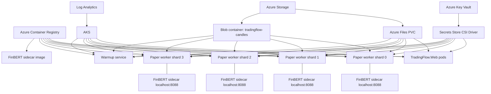

# TradingFlow Production AKS Plan

This document is the production target for TradingFlow on Azure Kubernetes Service. It keeps the current design intent:

- One strategy brain shared by backtest, paper, and live execution.
- Paper/live workers own ticker shards in memory for low-latency candle and indicator state.
- News catalysts are visible in paper UI and consumed only when the run config enables news.
- Demo/paper and live secrets are separated by namespace, identity, and Key Vault access.
- Web UI does not orchestrate trading logic; it calls APIs and displays state.

## Current Verified State

Local API:

- `GET /api/mobile/news/latest` returns Alpaca/Benzinga catalyst feed through the same runtime factory used by paper trading.
- Paper/live runner already loads catalysts when `run.News.Enabled` is true and attaches them to technical snapshots.
- Negative-news veto is already applied in the live/paper runner when news is enabled.
- Mobile Paper screen now has a `News Catalysts` preview card.

Verification run on 2026-06-14:

- Web build passed.
- Android build passed.
- Focused tests passed: `21/21`.
- Live local news smoke test returned `80` Alpaca catalyst items for `MSFT,NVDA,MU` over 168 hours.

## Target Azure Topology



## AKS Node Plan

System pool:

- 1-3 nodes
- `Standard_D4s_v5`
- Runs core Kubernetes services, ingress, CSI, monitoring.

Trading pool:

- 2-5 nodes
- `Standard_D8s_v5`
- Label: `workload=trading`
- Taint: `workload=trading:NoSchedule`
- Runs paper/live ticker-shard pods.

Paper worker pod layout:

- One C# worker container.
- One FinBERT sentiment sidecar container in the same pod.
- `FINBERT_SENTIMENT_URL=http://127.0.0.1:8088/analyze`.
- Pod anti-affinity spreads shards across nodes when capacity exists.

Default paper shards:

- shard 0: `POET,RGTI,NVTS`
- shard 1: `MXL,MU,MSFT`
- shard 2: `NVDA,INTC,APP`
- shard 3: `CRDO,RDW,OUST,SPCE`

These are config-map values, not code. We can move tickers between pods without rebuilding.

Storage model:

- `/app/data` is a single-writer Azure Disk (`ReadWriteOnce`) and stores SQLite plus operational runtime state. SQLite WAL must not run on Azure Files or a shared network filesystem.
- `/app/backups` is a separate durable backup target; daily SQLite online backups are integrity-checked and archived to Blob Storage. It must not share the operational disk's failure domain.
- `/app/cache` is pod-local `emptyDir` and stores hot candle/indicator working data. It is deliberately fast and disposable.
- TradingFlow owns its own candle archive under Blob container `tradingflow-candles`.
- ML/research systems may read Alpaca independently and store Parquet in their own format. Duplicate source reads are acceptable because the source price data is canonical and the systems optimize for different workloads.
- Backtest and research feedback stays under TradingFlow result roots unless an explicit export job is added later.

Warmup service:

- Deployment: `trading-flow-warmup-service`
- API: `POST /api/warmup/watchlist`, `POST /api/warmup/run-now`, `GET /api/warmup/runs`
- Web/mobile proxy: `TradingFlow.Web` calls `WarmupService__BaseUrl=http://trading-flow-warmup-service`, then exposes it through `/Warmup` and `/api/mobile/warmup/*`.
- Purpose: pre-load candle/news/indicator cache before paper/live workers need it.
- Default schedule: `20:30 America/New_York`, after the regular US close and suitable for next-day preparation.
- Storage: durable state under `/app/data/warmup`, hot artifacts/candle cache under `/app/cache/warmup`, then optional Blob upload through `Warmup__BlobContainerSasUrl`.
- Blob secret: `tradingflow-warmup-container-sas-url` in Key Vault, synced as `Warmup__BlobContainerSasUrl`.

## Secret Separation

Paper namespace:

- Namespace: `trading-flow-paper`
- Service account: `trading-flow-paper-worker`
- Identity: `id-tradingflow-paper-paper`
- Key Vault secrets:
  - `alpaca-paper-key-id`
  - `alpaca-paper-secret-key`
  - `finviz-api-key`

Live namespace:

- Namespace: `trading-flow-live`
- Service account: `trading-flow-live-worker`
- Identity: `id-tradingflow-paper-live`
- Key Vault secrets:
  - `alpaca-live-key-id`
  - `alpaca-live-secret-key`

Live secrets must not be mounted into paper pods. Paper secrets must not be mounted into live pods.

## Artifacts Added

Infrastructure:

- `deploy/azure/aks-main.bicep`
- `deploy/azure/sample-aks.parameters.json`
- `deploy/azure/render-aks-production.ps1`

Kubernetes production overlay:

- `deploy/aks/production/kustomization.yaml`
- `deploy/aks/production/namespace.yaml`
- `deploy/aks/production/serviceaccounts.yaml`
- `deploy/aks/production/configmap.yaml`
- `deploy/aks/production/storage.yaml`
- `deploy/aks/production/keyvault-secretproviderclasses.yaml`
- `deploy/aks/production/web.yaml`
- `deploy/aks/production/paper-worker-shards.yaml`
- `deploy/aks/production/warmup-service.yaml`
- `deploy/aks/production/networkpolicy.yaml`
- `deploy/aks/production/pdb.yaml`

Live secret overlay:

- `deploy/aks/live-secrets/kustomization.yaml`
- `deploy/aks/live-secrets/namespace.yaml`
- `deploy/aks/live-secrets/serviceaccount.yaml`
- `deploy/aks/live-secrets/keyvault-secretproviderclass.yaml`

Container build:

- `deploy/docker/Dockerfile.news` now builds the existing `sidecars/finbert-sentiment` service.

## Deployment Flow

Create resource group and deploy AKS infrastructure:

```powershell
$rg = "rg-tradingflow-paper"
$loc = "westeurope"

az group create -n $rg -l $loc

az deployment group create `
  -g $rg `
  -f deploy/azure/aks-main.bicep `
  -p deploy/azure/sample-aks.parameters.json `
  -o json > deploy/azure/aks-output.json
```

Build images:

```powershell
$acr = (Get-Content deploy/azure/aks-output.json | ConvertFrom-Json).properties.outputs.acrLoginServer.value
$acrName = $acr.Split(".")[0]
$tag = "2026.06.14"

az acr build -r $acrName -t tradingflow-web:$tag -f deploy/docker/Dockerfile.web .
az acr build -r $acrName -t tradingflow-worker:$tag -f deploy/docker/Dockerfile.trading-service .
az acr build -r $acrName -t tradingflow-finbert:$tag -f deploy/docker/Dockerfile.news .
az acr build -r $acrName -t tradingflow-warmup-service:$tag -f deploy/docker/Dockerfile.warmup-service .
```

Create Key Vault secrets:

```powershell
$kv = (Get-Content deploy/azure/aks-output.json | ConvertFrom-Json).properties.outputs.keyVaultName.value

az keyvault secret set --vault-name $kv --name alpaca-paper-key-id --value "<paper-key-id>"
az keyvault secret set --vault-name $kv --name alpaca-paper-secret-key --value "<paper-secret-key>"
az keyvault secret set --vault-name $kv --name finviz-api-key --value "<finviz-key>"
az keyvault secret set --vault-name $kv --name tradingflow-warmup-container-sas-url --value "<container-sas-url>"
```

Render manifests from Bicep outputs:

```powershell
.\deploy\azure\render-aks-production.ps1 `
  -BicepOutputJson deploy/azure/aks-output.json `
  -ImageTag $tag
```

Deploy:

```powershell
az aks get-credentials -g $rg -n aks-tradingflow-paper
kubectl apply -k deploy/aks/rendered/paper
kubectl get pods,pvc,svc -n trading-flow-paper
```

Live secrets are intentionally a separate overlay. Render and apply them only when you explicitly approve live trading:

```powershell
.\deploy\azure\render-aks-production.ps1 `
  -BicepOutputJson deploy/azure/aks-output.json `
  -ImageTag $tag `
  -SourceDir deploy/aks/live-secrets `
  -OutputDir deploy/aks/rendered/live-secrets

kubectl apply -k deploy/aks/rendered/live-secrets
```

## News Catalyst Test Before Production

Local test endpoint:

```powershell
$catalog = Invoke-RestMethod "http://127.0.0.1:53017/api/mobile/catalog"
$config = [uri]::EscapeDataString($catalog.paperConfigs[0].path)
Invoke-RestMethod "http://127.0.0.1:53017/api/mobile/news/latest?configPath=$config&tickers=MSFT,NVDA,MU&hours=168"
```

Production test after deployment:

```powershell
kubectl port-forward svc/trading-flow-web 5088:80 -n trading-flow-paper
$catalog = Invoke-RestMethod "http://127.0.0.1:5088/api/mobile/catalog"
$config = [uri]::EscapeDataString($catalog.paperConfigs[0].path)
Invoke-RestMethod "http://127.0.0.1:5088/api/mobile/news/latest?configPath=$config&tickers=MSFT,NVDA,MU&hours=168"
```

Expected:

- `enabled=true`
- `provider=alpaca`
- `items` may be empty for quiet tickers, but must not error.
- For active large tickers such as `MSFT,NVDA,MU`, recent Benzinga/Alpaca items should appear.

## Information Needed From You

Azure:

- Subscription ID.
- Preferred region: I suggest `westeurope` because you are in Europe.
- Resource group name.
- DNS domain for the web UI, if you want public HTTPS.
- Whether to deploy one AKS cluster with paper/live namespaces, or separate AKS clusters. My recommendation: one cluster for now, separate namespaces and identities; separate cluster only when real-money live trading becomes material.

Trading operations:

- Final paper ticker shards for the first production run.
- Whether each shard should own 10, 20, or more tickers.
- Alpaca account/feed details for the paper environment. Alpaca is the only production broker integration.
- Whether live trading should initially deploy with `replicas: 0`.

Secrets:

- Alpaca paper key ID and secret in Key Vault.
- Finviz API key if used.
- FinBERT can run local sidecar; no key needed.
- Live Alpaca keys only when you explicitly approve live rollout.

Risk controls before live:

- Daily max loss per shard.
- Max concurrent positions per shard.
- Max notional per ticker.
- Kill switch behavior: namespace-wide scale down, broker order cancel, or both.

## Production Risks

- Broker write idempotency must be proven before automatic retries around order placement.
- If a shard pod restarts, it must rebuild warm-up state and reconcile broker positions before accepting new entries.
- Azure Files is convenient for shared data but can become a bottleneck for very high-frequency candle writes. Long term, candles/results should move to Blob/Data Lake with local pod cache.
- FinBERT sidecars are CPU/memory heavy. If latency matters, dedicate a model node pool or replace with a hosted inference endpoint.
- News sentiment can be noisy. Use it as catalyst/veto context, not as a standalone entry trigger.
- Network policy is intentionally restrictive; add ingress controller rules after choosing DNS/TLS.
