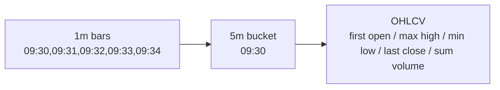
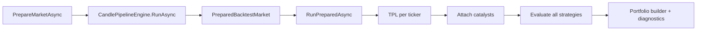
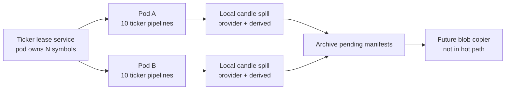
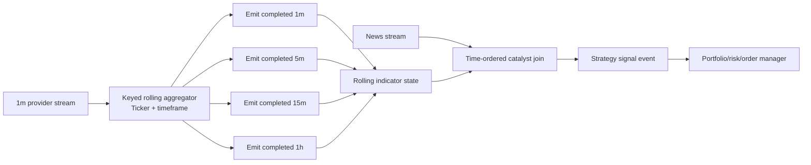

# Candle, Timeframe, Indicator, and News Pipeline Audit

This document traces how TradingFlow reads candles, keeps market state in memory, derives higher timeframes, computes indicators, and merges optional news catalysts before strategy evaluation.

## Current Runtime Shape

```mermaid
flowchart LR
    CFG["Run config\nbacktest / paper / live"]
    PROVIDER["IMarketDataProvider\nAlpaca / CSV"]
    READ["Async provider read\nGetBarsAsync"]
    BUFFER["BufferBlock<CandleEvent>\nbounded capacity"]
    NORMALIZE["TransformBlock\nnormalize + validate OHLCV"]
    GROUP["ActionBlock\ngroup by ticker/timeframe"]
    STORE1["ICandleStore\nlocal durable spill"]
    DERIVE["BarResampler\nmissing timeframes"]
    STORE2["ICandleStore\nderived candle spill"]
    INDICATORS["TransformBlock\nStock Indicators + custom VWAP/RVOL"]
    STATE["TickerMarketState\nBarsByTimeframe + SnapshotsByTimeframe"]
    NEWS["ICatalystProvider\nAlpaca / Finviz / none"]
    ATTACH["Attach latest catalyst\nto each snapshot"]
    SIGNAL["SignalGenerator\nsnapshot + bars -> TradeSignal"]
    EVAL["BasicStrategyEvaluator\nconfig gates"]
    EXEC["Backtest fills / paper orders / audit"]

    CFG --> PROVIDER
    PROVIDER --> READ --> BUFFER --> NORMALIZE --> GROUP --> STORE1 --> DERIVE --> STORE2 --> INDICATORS --> STATE
    CFG --> NEWS --> ATTACH
    STATE --> ATTACH --> SIGNAL --> EVAL --> EXEC
```



## Candle Pipeline

Code entry: `src/TradingFlow.Engine/Pipeline/CandlePipelineEngine.cs`

The engine builds a bounded TPL Dataflow pipeline:

1. `BufferBlock<CandleEvent>` receives provider bars.
2. `TransformBlock<CandleEvent, NormalizedCandleEvent?>` validates and normalizes:
   - ticker upper-case
   - timeframe lower-case
   - timestamp UTC
   - valid OHLC and non-negative volume
3. `ActionBlock<NormalizedCandleEvent?>` groups bars in memory by `(ticker, timeframe)`.
4. Missing required timeframes are derived from `market_data.derive_from`.
5. A second TPL Dataflow stage computes indicator snapshots per ticker/timeframe.

When a run supplies `CandleStoreContext`, normalized provider candles and derived candles are persisted through `ICandleStore` before indicator calculation. This gives paper/live a local recovery trail without coupling the pipeline to local files or Azure Blob.

The final object is `TickerMarketState`:

```text
Ticker
BarsByTimeframe:
  1m -> OhlcvBar[]
  5m -> OhlcvBar[]
  1h -> OhlcvBar[]
SnapshotsByTimeframe:
  1m -> IndicatorSnapshot[]
  5m -> IndicatorSnapshot[]
  1h -> IndicatorSnapshot[]
```

## Timeframe Derivation

Code: `src/TradingFlow.Engine/Market/BarResampler.cs`

The resampler converts a lower timeframe into a requested higher timeframe by UTC bucket:

```text
open   = first source bar open
high   = max source high
low    = min source low
close  = last source bar close
volume = sum source volume
time   = floored bucket timestamp
```

Example:



Current limitation: derivation is batch/in-memory after provider read completes. It is not yet a continuous rolling aggregator that emits a completed 5m candle the instant the fifth 1m candle closes.

## Indicator Calculation

Code: `src/TradingFlow.Engine/Indicators/IndicatorEngine.cs`

Standard indicators use `Skender.Stock.Indicators`:

- SMA 10/20/50
- EMA 10/20/50/200
- RSI 14
- ATR 14
- MACD 12/26/9
- Bollinger Bands 20/2

TradingFlow still owns custom session-aware calculations:

- session VWAP
- slot RVOL
- cumulative same-time RVOL
- session RVOL

This keeps common indicator math in a proven library while preserving trading-session semantics that are specific to our system.

## News Merge

Code:

- `src/TradingFlow.Engine/Abstractions/ICatalystProvider.cs`
- `src/TradingFlow.Data/Catalysts/CatalystStreamer.cs`
- `src/TradingFlow.Backtesting/CatalystSnapshotAttacher.cs`
- `src/TradingFlow.Backtesting/BacktestRunner.cs`
- `src/TradingFlow.Backtesting/LiveRunner.cs`

When `news.enabled` is true:

1. A provider loads ticker catalysts for the market window.
2. Catalysts are sorted by timestamp.
3. Each indicator snapshot gets the latest catalyst that occurred before that snapshot, if it is within the catalyst lookback window.
4. `SignalGenerator` copies catalyst context into `TradeSignal`.
5. `BasicStrategyEvaluator` applies strategy config such as:
   - `require_positive_news`
   - `min_news_sentiment`
   - `veto_news_sentiment_below`
   - `max_news_age_hours`
   - catalyst price-move bounds

Paper/live also keeps a final negative-news veto before order submission.

## Backtest Flow



Backtest prepares market state once, then strategies evaluate against the same candles and indicators. This is important for optimization because parameter combinations should reuse prepared market state rather than re-downloading/recomputing candles.

## Paper / Live Flow

```mermaid
flowchart LR
    A["LiveRunner iteration"] --> B["Fetch active broker state"]
    B --> C["CandlePipelineEngine.RunAsync"]
    C --> D["Parallel.ForEach ticker"]
    D --> E["Attach catalysts if news enabled"]
    E --> F["Write chart metric artifact"]
    F --> G["Technical exit check"]
    G --> H["Signal + evaluator"]
    H --> I["News veto if enabled"]
    I --> J["Order submission / audit"]
```



Paper/live runs the same candle and indicator pipeline as backtest. It evaluates the latest snapshot per strategy timeframe, then submits or rejects based on strategy, portfolio, and broker state.

## Candle Store and Recovery

Code:

- `src/TradingFlow.Engine/Abstractions/ICandleStore.cs`
- `src/TradingFlow.Data/Candles/LocalFileCandleStore.cs`

`ICandleStore` is the persistence boundary for candle history produced while a pipeline is running. The first implementation is local-file based:

```text
data/candles/{scope}/{runName}/{provider}/{source}/{timeframe}/{ticker}/{yyyy-MM-dd}.jsonl
data/candles/_archive-pending/{timestamp}-{manifestId}.json
```

`source` is currently `provider` or `derived`, so raw Alpaca/CSV candles and engine-resampled candles are auditable separately.

The local implementation:

- upserts by candle timestamp instead of blindly appending duplicate overlapping windows
- uses per-file locks for concurrent ticker writes
- writes files atomically through temporary files and replace/move
- emits `_archive-pending` manifests that a future Azure Blob copier can consume

Azure Blob upload is intentionally not part of `ICandleStore` yet. The cleaner production shape is a separate archival worker that scans pending manifests, copies completed local files to blob, and marks manifests complete. That keeps the hot paper/live path fast and avoids broker execution latency depending on cloud storage writes.

## Scale-Out Shape for Hundreds of Stocks

For hundreds of tickers, paper/live should run a keyed in-memory pipeline per ticker assignment:



The existing `ITickerLockService` is the right abstraction for this direction. In production, the backing implementation should be a distributed lease store such as Azure Blob leases, Redis, PostgreSQL advisory locks, or Cosmos DB with TTL. Each pod should:

- acquire a bounded ticker set, for example 10 symbols
- keep those ticker pipelines warm in memory
- write provider and derived candle spill locally through `ICandleStore`
- renew leases while healthy
- release or let leases expire on shutdown/failure

On restart, a pod can rebuild warm indicator state from local candle files first, then fetch any gap from Alpaca before resuming live processing.

## Current Strengths

- Backtest, paper, and live all consume `TickerMarketState`.
- Ticker failures are isolated when fail-fast is disabled.
- TPL Dataflow gives bounded capacity and configurable worker count.
- Standard indicators now come from Stock Indicators instead of handwritten math.
- News catalysts are now merged before signal generation in both backtest and paper/live.
- Candle persistence is behind `ICandleStore`; local files are now only one implementation.

## Current Gaps

- Timeframe derivation is batch/in-memory, not an incremental rolling stream.
- `BarResampler` floors buckets in UTC, not explicit exchange-session anchored buckets.
- Daily candles are not derived by `BarResampler`; daily should be downloaded directly or handled by a dedicated session-aware daily aggregator.
- Indicator calculation recomputes the full ticker/timeframe window each iteration; paper/live should eventually use rolling indicator state.
- Strategy evaluation still loops over prepared snapshots; a future live architecture should evaluate on completed-candle events.
- Azure Blob archival is not implemented; only local files and pending manifests exist.

## Target Streaming Design



This is the direction for a lower-latency paper/live engine. Backtest can stay batch-oriented for speed and reproducibility, but paper/live should eventually process completed candle events as they happen.
