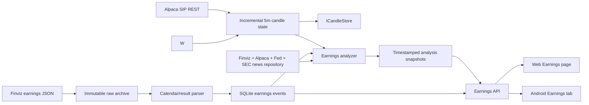

# Earnings Calendar And Reaction Monitor

## Purpose

The earnings feature answers three separate questions for every company in the available
Finviz today/next-reporting-day calendar:

1. Which companies report today or on the next weekday, and when?
2. Did the reported EPS/revenue result beat or miss the available estimates?
3. Do completed extended-session candles confirm a possible bullish breakout after the result became observable?

The result is advisory. It does not submit, alter, or cancel an order.

The operator can filter the API and both clients by release session (`BeforeMarketOpen`,
`DuringMarket`, or `AfterMarketClose`) and by non-overlapping Finviz market-cap bands:
under $10B, $10B-$50B, $50B-$100B, and $100B or greater. Missing provider capitalization
is kept as an explicit `unknown` band rather than silently classified.

## Providers

- Finviz Elite is the schedule and reported-result provider. TradingFlow reads the structured
  `/api/calendar/earnings` response used by the Finviz calendar UI, archives the exact JSON
  before parsing, and follows every returned page.
- Alpaca SIP supplies 5-minute OHLCV reaction bars, including premarket and after-hours bars.
- The shared news repository supplies company and market headlines, provider publication
  timestamps, links, article previews, and sentiment from Finviz and Alpaca.
- The Federal Reserve monetary-policy RSS feed supplies official Fed evidence.
- SEC EDGAR current filings supply 8-K, 10-Q, 10-K, 6-K, and 20-F evidence for calendar
  tickers when `SEC_USER_AGENT` contains the operator's required identifying contact string.
- Alpaca's `/v2/calendar` endpoint is an exchange-session calendar. It is not an earnings
  calendar and is therefore not used as the earnings schedule source.

Useful provider references:

- [Finviz Earnings Calendar](https://finviz.com/calendar/earnings)
- [Finviz earnings price-reaction overview](https://finviz.com/blog/price-reaction-to-earnings-reports/)
- [Alpaca exchange calendar](https://docs.alpaca.markets/us/reference/calendar)

## Point-In-Time Contract

Three timestamps are intentionally kept separate:

- `ScheduledAtUtc`: the Finviz schedule, converted from New York time with date-specific DST.
- `ResultFirstSeenAtUtc`: when a Finviz response first exposed an actual result or surprise.
- `ResultNewsPublishedAtUtc`: the provider publication time of the matched result article.

The analyzer never assumes that a result became tradable merely because the scheduled clock
time passed. Its reaction boundary is the matched result-news publication time when present,
otherwise the first provider-observed result time. All persisted timestamps are normalized to
UTC at the repository boundary. APIs return UTC instants plus the explicit New York market
context; web and Android clients render operator-facing timestamps in the device timezone.

## EPS Result Comparison

Each calendar row exposes the provider estimate, actual, surprise percentage, and an explicit
outcome. `EPS beat` means actual EPS is numerically greater than estimated EPS; `EPS miss` means
it is lower; equality is `Met estimate`. Direct comparison is important for losses: actual EPS
of -$0.10 beats an estimate of -$0.20. When adjusted EPS is unavailable, the Finviz reported/GAAP
fields are used as a fallback. A price increase is never used to infer an EPS beat.

The monitor also retains a bounded historical Finviz calendar window around the expected prior
quarter and attaches the latest earlier reported event for the same ticker. This historical
refresh runs at most once per 24 hours, has its own two-minute timeout, and cannot stop current
calendar or reaction monitoring if the provider request fails. The UI labels missing prior data
as unavailable/loading instead of inventing a result.

## Processing Flow

The first observation of a newly scheduled symbol backfills 100 calendar days of 5-minute candles,
which covers the 63 prior US trading sessions used by the shared same-slot RVOL calculation. Later
iterations request only a five-minute overlapping increment. Bars are upserted through
`ICandleStore`, cached in memory, and trimmed to the configured rolling window. This avoids
re-downloading the complete history every minute and makes restart recovery deterministic.

## Assessment Rules

Result assessment:

- `Positive`: every available EPS/revenue surprise is non-negative and at least one is positive.
- `Negative`: every available surprise is non-positive and at least one is negative.
- `Mixed`: available EPS and revenue surprises disagree.
- `Unknown`: no actual surprise is available yet.

`PossibleBreakout` requires all of the following from completed 5-minute bars:

- result assessment is `Positive`;
- latest close is above the pre-result reference high;
- EMA10 is above EMA20;
- MACD histogram is positive;
- same-slot relative volume is at least 1.5x and has all 63 prior-session samples.

Otherwise the status is `AwaitingEarningsRelease`, `BreakoutDataInsufficient`, or
`BreakoutNotConfirmed`, with the exact evidence in `Reason`. The API also returns a combined,
operator-facing label such as `Positive earnings · breakout not confirmed`. Current-bar data is
excluded until the five-minute bar has completed.

## Runtime And API

Default monitor settings:

- calendar refresh: 15 minutes;
- candle/news analysis: 1 minute;
- bounded iteration timeout: 45 seconds;
- analysis snapshot heartbeat: 15 minutes;
- maximum concurrent analyses: 8.

The hosted monitor runs independently of the web and mobile pages. It re-evaluates every
calendar ticker once per minute as completed Alpaca bars and provider news become available;
closing the Earnings page does not stop analysis.

Endpoints are available under both `/api/earnings` and `/api/mobile/earnings`:

- `GET /today-next-business-day`
- `GET /calendar?from=yyyy-MM-dd&to=yyyy-MM-dd`
- `GET /status`
- `POST /refresh`

Both calendar GET endpoints accept `session=all|beforeMarketOpen|duringMarket|afterMarketClose`
and `marketCap=all|under10b|10bTo50b|50bTo100b|100bPlus|unknown`. Invalid values return HTTP 400.
Responses include the active filter values and option counts so clients do not duplicate filter
boundaries or labels.

Calendar responses are not restricted by wishlist membership. Manual refresh updates the
calendar, Alpaca bars, shared news cache, and analysis together. Both the earnings and news
refresh loops are serialized, so manual and automatic refreshes cannot overlap themselves.

## Evidence Window And Deduplication

The evidence grid is chronological, newest first:

- normal weekdays: latest 24 hours;
- from Friday 22:00 through Monday 13:00 in the configured operator timezone: evidence starts Friday at 22:00;
- raw cache retention: 72 hours, which safely covers the full weekend window.

Raw provider rows remain in SQLite for provenance. The operator projection collapses equivalent
headlines across providers, combines related tickers, and filters broad market items unless they
carry company, earnings, Fed, SEC, or macro relevance. This avoids deleting audit evidence while
preventing repeated wire copies from filling the screen.

`TRADINGFLOW_OPERATOR_TIME_ZONE` optionally fixes the server-side calendar and weekend-window
timezone for a deployment. When unset, the service uses the host machine timezone. This setting
never changes persistence: database and API timestamps remain UTC, while each client formats
those instants in its own device-local timezone.

## User Interfaces

- Web: `/Earnings`, with a chronological evidence grid and complete Today/Next reporting day
  groups, release-session and cap-band filters, current-versus-previous EPS comparison, result
  and breakout badges, compact surprise/move metrics, and expandable timestamps.
- Android: `Earnings` tab with the same API contract, grouped compact cards, expandable evidence,
  release-session and cap selectors, prior EPS context, and a direct news link.

The shared web header and Android environment badge show two derived clocks: the US market
clock from the configured New York exchange timezone and the local clock from the browser or
device timezone. City labels are derived from the timezone identifiers, so the local label is
not fixed to Amsterdam.
