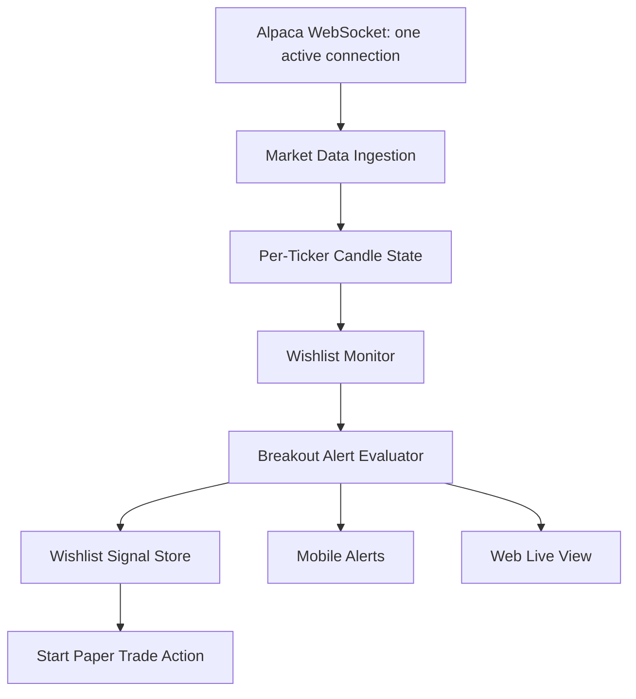

# Wishlist Architecture Plan

## Intent

Move tradable stock groups out of paper environment YAML and into a database-backed wishlist model. YAML should describe runtime and strategy behavior; user-selected stock groups are mutable product state and belong in storage.

## Roles

- Trader workflow: maintain named groups, watch real-time movement, receive useful breakout alerts, and start paper trades from a ticker or the whole group.
- Distributed-system workflow: one market-data ingestion path fans out normalized state to web, mobile, paper trading, and alerting without each client opening provider streams.

## Core Model

- `Wishlist`: named group with description, default flag, extended-hours flag, created/updated timestamps.
- `WishlistItem`: ticker membership, active flag, notes/tags, added timestamp.
- `WishlistSignal`: persisted alert generated from market state, including ticker, type, severity, detected time, price, reason, and indicator snapshot.

## Runtime Shape

Paper and live runners should consume a `ITradableUniverseProvider` instead of reading tickers directly from a YAML file.

Initial providers:

- `WishlistUniverseProvider`
- `YamlTickerUniverseProvider` only as a temporary compatibility path
- later `FinvizUniverseProvider`

Example run config:

```yaml
universe:
  source: wishlist
  wishlist_name: Intraday Movers
  include_extended_hours: true
```

Extended hours are always enabled for monitoring and paper/live execution unless a strategy explicitly blocks a session for risk reasons.

## Real-Time Monitoring

Use one backend market-data stream and fan out internally:



## First Alert Rules

Do not alert on "green candle only." First version should look for participation and structure:

- Price above or reclaiming VWAP.
- EMA10 above/reclaiming EMA20.
- MACD histogram positive or improving.
- Cumulative volume above historical same-session expectation.
- Bar closes in the upper part of its range.
- Break above recent high, opening range, or premarket high.
- Guard against chasing when price is too extended from VWAP/ATR.

Alerts are informational first. Auto-trading from wishlist signals should be opt-in per wishlist after alert quality is proven.

## Web UI

Add a `Wishlists` main tab:

- create, rename, delete wishlists
- add/remove tickers
- show live movement, VWAP/EMA/MACD/volume state, last signal
- actions: start paper trade for one ticker, start all, view audit, mute alerts

## Mobile UI

Add a `Wishlists` tab:

- compact named wishlist cards
- ticker rows with price, move %, signal badge, last reason
- tap/right-action to start paper trade
- in-app alerts first, Android notifications later

## Implementation Order

1. Add DB tables and repository.
2. Add APIs for wishlist CRUD and ticker membership.
3. Refactor paper runner to accept a universe provider.
4. Add wishlist monitor over existing candle state.
5. Persist breakout signals.
6. Add web wishlist tab.
7. Add mobile wishlist tab.
8. Add start-paper-trade action from wishlist signal.
9. Add tests for repository, universe provider, signal evaluator, and paper run from wishlist.
10. Rebuild backend/mobile, verify ngrok, and install Android app.
